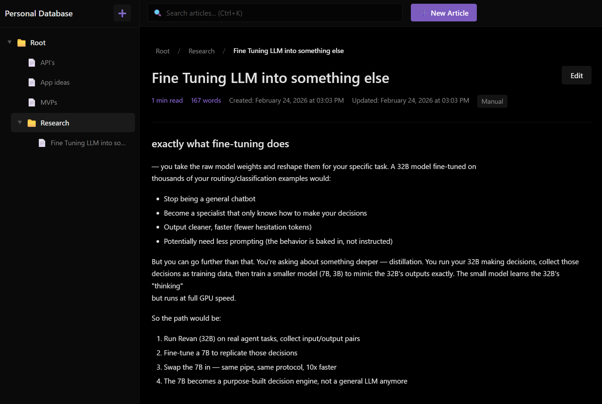

# PDB

Your own personal Wikipedia. A desktop knowledge base where you dump everything you know, find, or want to remember -- and actually find it again later.



Built with Tauri 2 (Rust backend, Svelte frontend). Everything runs locally, nothing phones home, your data is a single SQLite file on your machine.

## What it does

You get a sidebar tree on the left with folders (categories) and articles inside them, and a content area on the right that renders your markdown. That's the core of it -- hierarchical organization with a wiki-style editor.

The tree supports unlimited nesting. Every folder can have a custom emoji icon (there's a picker with 500+ of them). You can drag and drop articles and folders to reorganize. Right-click anything for a context menu with rename, delete, move, change icon.

Articles are written in markdown with live preview. They support wiki-style `[[links]]` -- type `[[Article Name]]` and it becomes a clickable link to that article, like Wikipedia. There's also color coding if you want to visually tag articles (13 pastel colors available).

Search is instant. It uses SQLite FTS5 (full-text search) under the hood, so it's searching the actual content of every article, not just titles. `Ctrl+K` opens the search bar, `Ctrl+P` opens a quick switcher that fuzzy-matches across everything.

Each article shows a reading time estimate, word count, creation/update timestamps, and auto-generates a table of contents from your headings in a sticky sidebar.

File attachments work too -- you can attach any file to an article and it gets copied into the app's data directory with a unique name so nothing collides.

## Keyboard shortcuts

| Key      | Action               |
| -------- | -------------------- |
| `Ctrl+K` | Search               |
| `Ctrl+P` | Quick switcher       |
| `Ctrl+N` | New article          |
| `Ctrl+S` | Save                 |
| `Esc`    | Close modal / cancel |

## Tech stack

The frontend is Svelte 4 with SvelteKit (static adapter) and Vite. The backend is Rust via Tauri 2, with rusqlite for the database. Communication between frontend and backend goes through Tauri's invoke system -- typed commands, no HTTP.

The database is SQLite with WAL mode, FTS5 triggers for search indexing, and proper foreign keys with cascade deletes. Schema auto-creates on first run.

Data lives in your OS app data directory (`%APPDATA%\pdb\` on Windows, `~/Library/Application Support/pdb/` on macOS, `~/.local/share/pdb/` on Linux).

## Building from source

You need Node.js, Rust, and the [Tauri 2 prerequisites](https://v2.tauri.app/start/prerequisites/).

```
npm install
npm run tauri build
```

The installer ends up in `src-tauri/target/release/bundle/`. On Windows you get both an MSI and an NSIS setup exe.

For development:

```
npm run tauri dev
```

This starts the Vite dev server with hot reload and opens the app window. Changes to Svelte files update instantly, changes to Rust files trigger a recompile.

## Project layout

```
src/
  routes/+page.svelte          main app page
  lib/components/
    TreeNav.svelte              sidebar tree with drag-drop
    ArticleView.svelte          article display + table of contents
    Editor.svelte               split-pane markdown editor
    CategoryView.svelte         folder overview (subcategories + articles)
    SearchBar.svelte            live search dropdown
    QuickSwitcher.svelte        fuzzy finder modal (Ctrl+P)
    Breadcrumbs.svelte          navigation trail
    IconPicker.svelte           emoji selector for folders
    Toast.svelte                notification stack
  lib/stores/
    db.ts                       all Tauri commands + reactive stores
    dragState.ts                drag-and-drop state management
    toast.ts                    notification queue

src-tauri/src/
  main.rs                       entry point
  lib.rs                        Tauri setup + plugin registration
  commands.rs                   all IPC command handlers
  db.rs                         SQLite schema, queries, tree builder
```

## License

MIT
